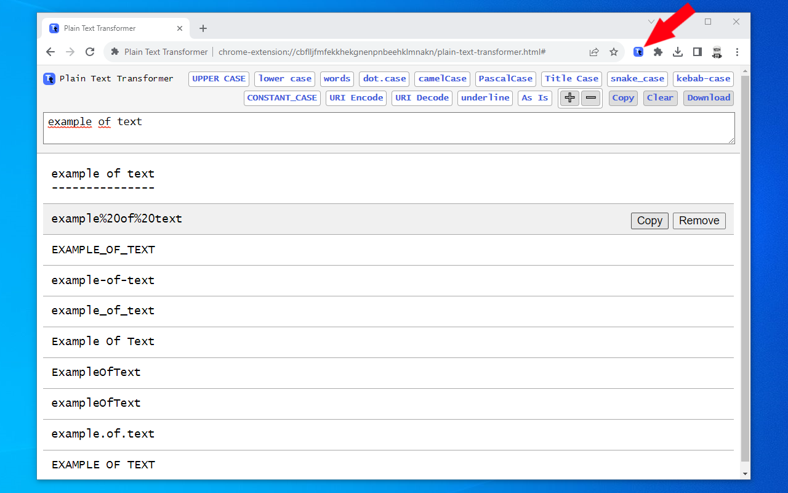

#  Chrome Extension - Plain Text Transformer 

Chrome extension that manipulates text (UPPER CASE, lower case, Title Case, camelCase, ...)

## Formats
- UPPER CASE
- lower case
- words
- dot.case 
- camelCase
- PascalCase
- Title Case
- snake_case
- kebab-case
- CONSTANT_CASE
- URI Encode
- URI Decode
- underline
- As Is

## Features

- Extracts text from the selection on the page
- Copy single result
- Copy all results
- Removing unwanted results
- Clear all results
- Saving of all results in a text file
- Text zoom

# Links
- My Home page: https://www.vincenzodevivo.com/
- My GitHub: https://github.com/deltavi

# ☕BUY ME A COFFEE
Want to buy me a coffee? By all means! Visit 
https://www.buymeacoffee.com/vincenzodevivo or https://www.paypal.com/paypalme/VincenzoDeVivoAutore

... or you can buy my books on Amazon 📚 https://www.amazon.it/Vincenzo-De-Vivo/e/B09MPTBBFY

## Screenshots

